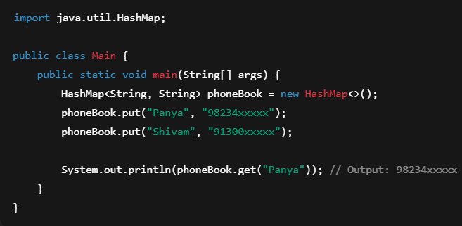
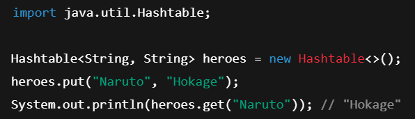

# 🌀 Definition & Purpose
* Hash Table ek aisa data structure hai jo **key-value pairs ko store** karta hai 

* ##### Key-value pairs
  * `"Panya" → Key
    "98234xxxxx" → Value`
> Aisa pairs mein data store karta hai
* Aur O(1) time mein access deta hai.

### 📌 Use hota hai jab:
* **Data ko naam se dhoondhna** ho (username → profile)
* **Count karna ho** (word → frequency)
* **Fast access chahiye**ho, like in caches or login systems

### 📦 Structure:
* **Non-linear**
* **Dynamic** (size badhta hai)
* **Memory** mein random jagah (pointer-based), **not contiguous**

# 🛠️ Syntax + Internals
##### Code


##### Working
* **Hash Function**: Key ko ek number (index) mein convert karta hai
* **Array**: Us index pe value store hoti hai
* **Collisions**: Do keys same index pe aaye to:
  * **Chaining** (Linked list se manage)
  * **Open Addressing** (aage check karte jao till empty)

# 🎯 Use Cases
* **Login systems**: userID → password
* Word count apps
* Fast data access apps (caches, auto-fill)
* **Backend storage** for HashSet, Map etc.

# ⚠️ Common Pitfalls
❌ **Galat hash function** → slow ho jata hai
❌ **No Mutable keys** mat do (key change ho gaya toh lookup fail karega)
  * **Mutable keys** == that can change after creation
    * HashMap ya HashTable:
      * Key ka `hashCode()` nikalta hai → bucket decide karta hai
      * Fir `equals()` se key ko match karta hai
    * Agar tu **key object change** kar deta hai:
      * **hashCode bhi change hota hai**
      * Toh woh key original bucket mein milegi hi nahi!
      * **Data dikhna band ho jata hai** (value hai par access nahi ho raha)
  
❌ **Memory zyada lagta hai** jab size control na ho
⚠️ Hashtable **thread-safe** hai **par slow hai** → HashMap zyada fast hai

# 🧠 Behind the Scenes
1. **Java pehle `hashCode()` nikalta hai**
* Soch: `"Naruto"` → hashCode = 123456 → bucket no. 5
  > Hashcode made by the key is used to decide to put this in which bucket

2. **Fir us number ko aur process kiya jaata hai**
* Taaki index aur bhi perfect mile (kam collision ho), it perfrom some **bitwise operations**

3. **Agar table bharne lagti hai (load factor > 0.75)**
* Jaise: agar 10 buckets hain, aur 8 full ho gaye = load factor = 0.8
* Jab `Load Factor > 0.75` ho jata hai, toh table ka size double kar diya jaata hai — is process ko bolte hain **rehashing**
  > Har purani entry ko nayi jagah fir se daala jaata hai
* **Why it is done?**
  * To maintain speed
  
4. **Java 8 ke baad: agar kisi bucket mein bahut saari values aa jaayein...**
* Pehle kya hota tha: woh saari values ek linked list mein store hoti thi
* Agar woh list lambi ho gayi (usually 8+ items), toh Java bolta hai:
  > “Ab list nahi banayenge, ab Tree banaenge (Red-Black Tree)” 🌲
* Tree fast hota hai — searching O(n) se O(log n) ban jaata hai
* Yaani: Slow bucket → now becomes Fast bucket 

# 🧩 Interview + Coding Questions
**🔥 Famous sawaal**:
Two Sum
Group Anagrams
Top K Frequent Elements
Design LRU Cache

### **🎯 Interviewers check karte hain**:
#### **Collision handling**
* **Prob** -> Kabhi kabhi **2 alag keys ka same hashCode index** aa jaata hai — isse bolte hain **collision**.
* **Solution** -> 
  * a. **Chaining**
    * Us bucket mein list ban jaati hai
    * Saari values ek ke baad ek linked list mein store hoti hain
    * Jab `get()` karega, to vo list mein check karega kis key ke saath value match ho rahi hai
  * b. **Tree Banana** (Java 8 ke baad)
     * Agar list bahut lambi ho jaaye (8 ya zyada) to Java use tree bana deta hai
    
#### **Custom implementation**
* **Que** -> "Apna khud ka HashMap bana sakte ho?"
* **Ans** -> Yes
  * Andar ek array hota hai
  * Har element ek box (bucket) hai
  * Har bucket mein key-value pair store hota hai
  * Agar same bucket mein do value aayi, to unka linked list bana dete hain
  ```
  Entry[] table = new Entry[5];

  table[0] → [Key1, Val1]  
  table[1] → null  
  table[2] → [Key2, Val2] → [Key3, Val3]  (linked list due to collision)  
  table[3] → null  
  table[4] → [Key4, Val4]
  ```
  
#### **Memory/time complexity ka gyaan**
**Time**
* **Que** -> Kitni fast hai aur kitna space lagta hai?
* **Ans** -> Time Complexities

  | Kaam     | Kitna Time Lagta Hai |
  | -------- | -------------------- |
  | put()    | Fast – O(1)          |
  | get()    | Fast – O(1)          |
  | remove() | Fast – O(1)          |

**Memory**
  * Thoda extra memory lagti hai kyunki:
    * Array
    * Key-value object
    * List ya tree (agar collision aaye)