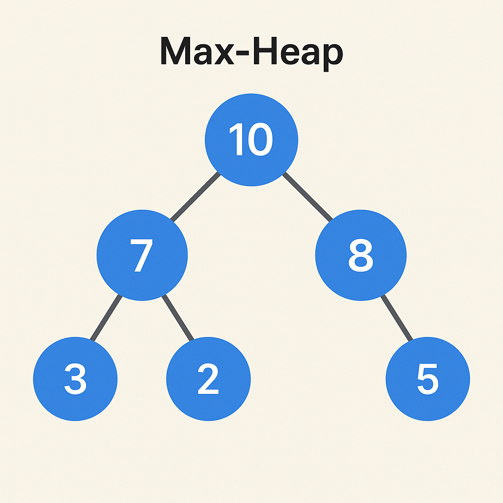

# 🌀 Definition & Purpose
## Definition:
- Max-Heap ek **binary tree-based** data structure hai 

> Parent node >= Child node

**Purpose**: To find **largest number** fast.

### Best suited for:
- Element with most frequent count.
- Scheduling, simulations, ranking systems

### Type:
- **Non-linear**(tree-based)
- Usually **dynamic size** (grow/shrink hota hai)

### Memory layout:
- **Contiguous array** mein store hota hai internally (pointer-based nahi hota Java `PriorityQueue` mein)

