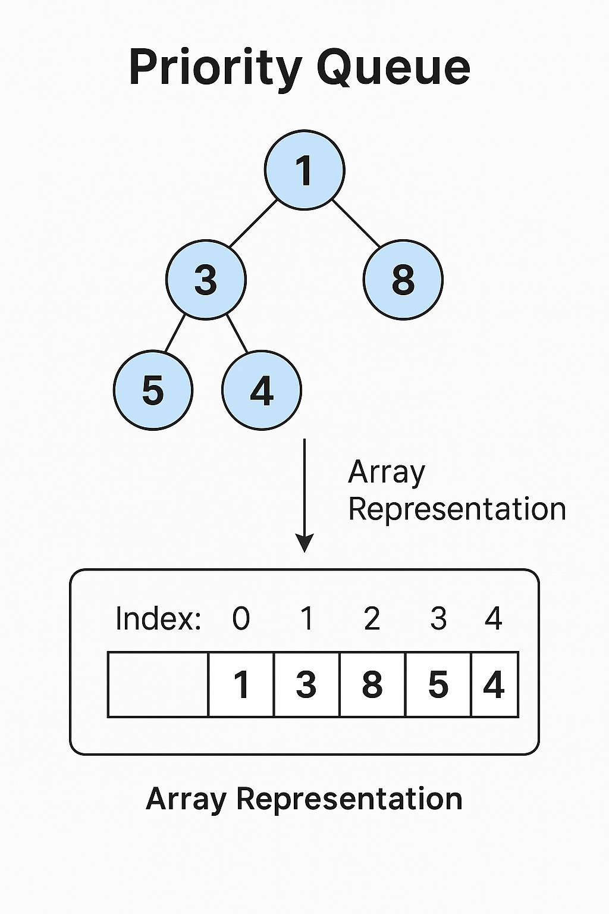

# 🌀 Definition & Purpose 
- Special queue 
-  Elements **priority ke according store** hote hain, not insertion order. 
  


## Why?
When we need to arrange things acc to **priority**.

## Non-linear
- Logically -> **Non-linear** (because priority-based order)
- Implementation ->  Mostly binary heap (array-based)

## Dynamic
- size grow/shrink hota hai.

## Memory layout - contagious
Usually contiguous array internally (Binary Heap).

**** 

# 🛠️ Syntax + Core Ops
### Create/Initialize:
```
PriorityQueue<Integer> pq = new PriorityQueue<>(); // Min-heap default
PriorityQueue<Integer> maxPQ = new PriorityQueue<>(Collections.reverseOrder());
```

### Core Ops:
- `add()` / `offer()` → insert
- `poll()` → remove and return highest-priority
- `peek()` → just see highest-priority
- `contains()` → search element

### Traversal:
```
for (int val : pq) {
    System.out.println(val);
}
```
*Note*: Order in iteration is not sorted order.

### Built-in methods:
- `add`, `offer`, `poll`, `peek`, `remove`, `size`, `isEmpty`, `contains`, `clear`

### Time Complexity:
- Insert → O(log n)
- Remove → O(log n)
- Peek → O(1)

**Space Complexity: O(n)**
**Memory handling**: Resizes automatically when needed (like ArrayList).

****

# ⚠️ Common Pitfalls
- The answer can be unsorted, so **assuming it as sorted can cause mistake**
- Forgetting min-heap default in Java (for max-heap use comparator)
- **Modifying elements inside PQ** (can break heap property)
- **`Null` value not allowed** in Priority Queue
- Assuming thread-safety → **normal PQ is not thread-safe**

