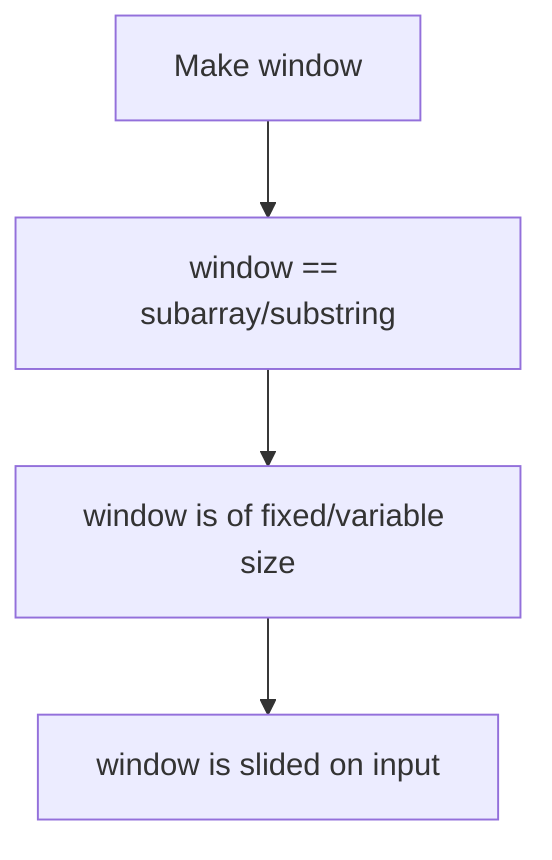
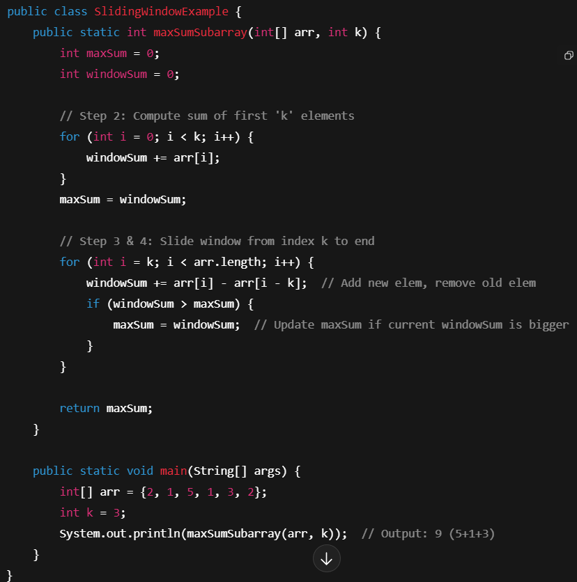
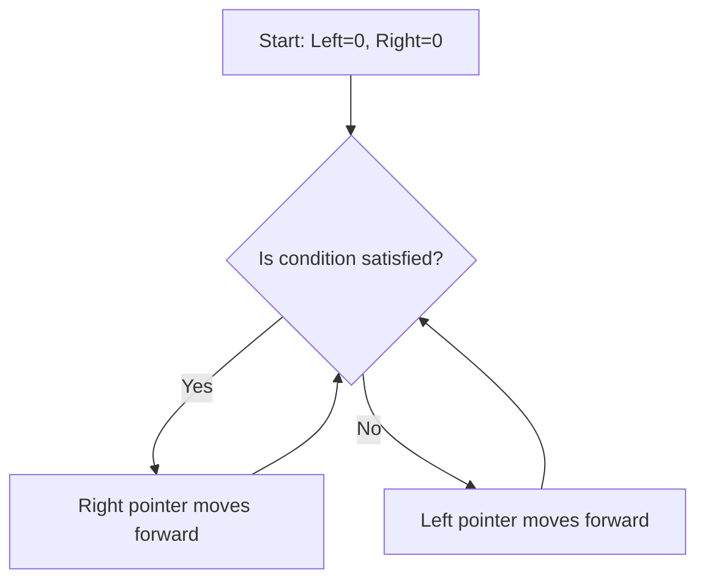

# 🌀 Definition & Purpose
### Definition:
Sliding Window **ek technique hai**, khud ek data structure nahi hai.


### Purpose
* Repeated computation avoid karna.
* Time complexity reduce karna (O(n²) → O(n)).

### When to use
* sliding window is your go-to tool jab tumhe **lagataar continuous chunks ko fast analyze karna ho**, chaahe wo fixed ho ya flexible size ka.
* ex **Continous**
  * longest substring without repeating chars
  *  subarray ka maximum sum.
* ex **Moving Average**
  * we have to move in array/string and calculate average of subarray/substring
    * Find average temp of 5 days from month data,   
* ex **Fixed size**
  * Find sum of three element
  * 3-length ka substring
* ex **Variable size**
* *Longest substring with at most 2 distinct chars* — yahan window apne aap expand ya shrink hota rahega jab tak condition satisfy na ho.

### Modern Variant
* Deque
* LinkedList
* ArrayDeque


# 🛠️ Syntax + Core Ops
## Sliding Window — Step-by-step Guide with Example
#### Step 1: Define the window size (k)
Fixed size sliding window ke liye, tum ek size decide karte ho, jaise `k = 3`. Matlab hum hamesha 3 elements ka window slide karenge.

#### Step 2: Initialize window sum or data (agar sum chahiye)
Pehle k elements ka sum ya data compute karlo, jise hum “first window” kehte hain.
``` 
for (int i = 0; i < k; i++) {
    windowSum += arr[i];
}
```
#### Step 3: Slide the window
Phir window ko ek element aage slide karo:
* Naya element add karo (right side).
* Purana element remove karo (left side).
  `windowSum += arr[i] - arr[i - k];`
* Update result if required
  ```
  if (windowSum > maxSum) {
        maxSum = windowSum;  // Update maxSum if current windowSum is bigger
    }
  ```
#### Step 4: Repeat till end of array/string

## Example


> **Sliding window ka funda**:
Har step pe sirf 2 operations karna —
> 1) **Add new element (right side)**
> 2) **Remove old element (left side)**


## Complexity:
#### Time 
Fixed window: O(n)
Variable window: O(n) (two-pointer method)
#### Space
Space: O(1) to O(k) depending on window storage.

<br>

### Memory handling:
Java automatically manage karega, tumhe manual memory deallocation ka tension nahi.

# 🧪 Use Cases (Real-World & Patterns)
**Real-world:**
* Moving average in stock prices.
* Network bandwidth monitoring.
* Video buffering (YouTube ka preloading).

**Coding patterns:**
* Fixed-size window
* Variable-size window (two pointers)
* Monotonic queue (max/min in window)

**Software systems:**
* Streaming analytics.
* Log monitoring.

# ⚠️ Common Pitfalls 
* Window update logic galat likhna (purane element ko remove karna bhoolna).
* Variable window me right pointer slide karte waqt left pointer adjust na karna.
  * Sliding window me **do pointers** hote hain — left aur right.

<br>

* Index out of bounds.
* Fixed vs variable window mix-up.

**Interview me dhyan:**
* Dry run zaroor karo.
* Edge cases: empty array, window size > array length.

